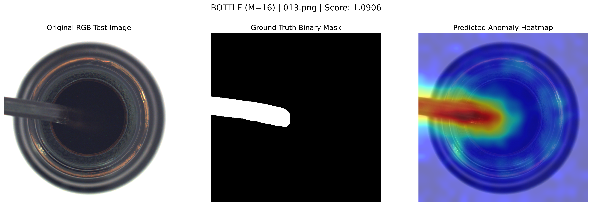

# Edge AI Anomaly Detection: Resolving the Trilemma

A fast, memory-efficient, few-shot ($N \le 10$) industrial anomaly detection system optimized for
CPU-bound edge gateways. This repository contains the official prototype for the CMPSC 580 Junior
Seminar research project: *"Quantization-EVT Coupling and Morphological Boundaries in Few-Shot
CPU-Constrained Industrial Anomaly Detection."*

---

## 📌 Overview

Modern industrial visual inspection faces an **Edge AI Trilemma**: balancing geometric robustness,
memory footprint, and retrieval latency. This pipeline resolves the trilemma by replacing standard
exact-search memory banks with a symmetry-aware, quantized retrieval system.

**Key Architectural Features:**

- **$p4m$ Symmetry Augmentation:** Offline manifold expansion resolving right-angle rotational
  blindness for directional geometries.
- **8-bit FAISS IVF-PQ Memory Bank:** Compresses the feature index by >10x (450 MB → 38 MB) while
  preserving defect-discriminative structure.
- **EVT Thresholding:** Calibration-free, automated pass/fail boundaries modeled on Extreme Value
  Theory (GPD tail fitting).
- **CPU-Optimized:** Achieves a **12.73 ms retrieval-stage latency** on standard consumer CPUs with
  no GPU required.

---

## ⚙️ Installation & Setup (Works on Any Laptop)

I have verified that this prototype runs natively on **Windows, macOS, and Linux** using GitHub Actions. It will use a GPU automatically if one is available, but it is explicitly designed and optimized to run on a standard CPU — no GPU needed.

**Prerequisites:** Install these two tools first if you do not already have them:
- [Git](https://git-scm.com/downloads)
- [uv](https://docs.astral.sh/uv/getting-started/installation/) (An extremely fast Python package manager written in Rust)

---

### Step 1 — Clone the Repository

Open your terminal (macOS/Linux) or Git Bash / Command Prompt (Windows) and run:

```bash
git clone https://github.com/javito350/Object_Detector_For_Control_Quality_for_Factories.git
cd Object_Detector_For_Control_Quality_for_Factories
```

---

### Step 2 — Create a Virtual Environment and Install Dependencies

Because we are using `uv`, you can create an isolated virtual environment and install all of the project requirements in a single, lightning-fast step:

```bash
uv venv
uv pip install -r requirements.txt
```

Then **activate** the environment using the command for your operating system:

| Operating System | Command |
|---|---|
| **Windows** (Command Prompt or PowerShell) | `.venv\Scripts\activate` |
| **macOS / Linux** | `source .venv/bin/activate` |

> ✅ You will know it worked when you see `(.venv)` appear at the start of your terminal prompt.
> **Keep this terminal open for all remaining steps.**

---

### Step 3 — Download the Dataset & Model Weights

**Dataset (MVTec AD):**

You can find the required dataset for this project hosted here:
**[Project Data Repository](https://github.com/javito350/Quality_Control_Factory_Data)**

Once downloaded, extract it so your project folder looks exactly like this:

```plaintext
Object_Detector_For_Control_Quality_for_Factories/
├── data/
│   ├── bottle/
│   │   ├── train/
│   │   │   └── good/
│   │   └── test/
│   ├── screw/
│   │   ├── train/
│   │   └── test/
│   └── ... (other categories)
├── src/
├── weights/
└── ...
```

**Model Weights:**

The pre-trained model weights file (`calibrated_inspector.pth`) is included in the data repository linked above. Place it inside your local `weights` folder so it looks like:

```plaintext
weights/calibrated_inspector.pth
```

> ⚠️ The system will not run without this file. If you see a `FileNotFoundError` mentioning
> `calibrated_inspector.pth`, check that the file is in the `weights/` folder.

---

## 🚀 Usage Guide

### A. Single-Image Demo (Quickest way to verify everything works)

Run the inspection pipeline on one image. The system will print the anomaly score, pass/fail status,
and save a heatmap visualization into `presentation_results/`.

```bash
python src/run_demo.py data/bottle/test/broken_large/000.png --verbose
```

> 📝 Substitute `data/bottle/test/broken_large/000.png` with any valid image path from your
> downloaded dataset.

**Example Output:**

When running the command above on a defective bottle, the terminal will output the anomaly score and pass/fail status. The system will also generate a visualization in the `presentation_results/` folder highlighting the exact location of the defect:



To run batch inference on an entire folder at once:

```bash
python src/run_demo.py data/bottle/test/broken_large/
```

---

### B. Reproduce the Full 8-bit Deployment Evaluation

To replicate the 5-seed support-set variance analysis reported in the paper, run the evaluation
script for each of the 5 canonical random seeds:

```bash
python src/conference_multiclass_eval.py --pq-bits 8 --support-seed 111  --output-csv final_csv_exports/results_8bit_seed111.csv
python src/conference_multiclass_eval.py --pq-bits 8 --support-seed 333  --output-csv final_csv_exports/results_8bit_seed333.csv
python src/conference_multiclass_eval.py --pq-bits 8 --support-seed 999  --output-csv final_csv_exports/results_8bit_seed999.csv
python src/conference_multiclass_eval.py --pq-bits 8 --support-seed 2026 --output-csv final_csv_exports/results_8bit_seed2026.csv
python src/conference_multiclass_eval.py --pq-bits 8 --support-seed 3407 --output-csv final_csv_exports/results_8bit_seed3407.csv
```

---

### C. Aggregate Results into Final Table

After all 5 seeds have run, aggregate the CSVs into the final Markdown summary table (Mean ± SD for
Image AUROC and Pixel AUROC):

```bash
python final_csv_exports/summarize_seeded_bits8_markdown.py \
  final_csv_exports/results_8bit_seed111.csv \
  final_csv_exports/results_8bit_seed333.csv \
  final_csv_exports/results_8bit_seed999.csv \
  final_csv_exports/results_8bit_seed2026.csv \
  final_csv_exports/results_8bit_seed3407.csv
```

---

## 📊 Core Empirical Results (N=10 support shots)

Evaluated on the MVTec AD benchmark across 5 random support-set seeds under the deployed 8-bit
FAISS IVF-PQ configuration:

| Metric | Value |
|---|---|
| **Mean Image AUROC** | 0.7792 ± 0.0332 |
| **Mean Pixel AUROC** | 0.9013 ± 0.0064 |
| **Memory Footprint** | 38 MB |
| **Retrieval Latency** | 12.73 ms (CPU) |

---

## 🛠️ Troubleshooting

**`ModuleNotFoundError` (torch / faiss / cv2):**
Your virtual environment is not active. Close and reopen your terminal, navigate back to the project
folder, run the activate command from Step 2 again, then retry.

**`FileNotFoundError` for `calibrated_inspector.pth`:**
The model weights file is missing. Download it from the data repository in Step 3 and place it at
`weights/calibrated_inspector.pth`.

**`FileNotFoundError` for dataset images:**
The dataset is not in the right place. Re-read Step 3 and verify your folder structure matches the
tree shown there exactly.

**GPU / CUDA warnings:**
These are safe to ignore. The system automatically falls back to CPU if no GPU is detected. This is
the intended behavior for edge deployment simulation.

**`python` command not found (Windows):**
Try `python3` instead of `python`, or verify Python was added to your PATH during installation.

---

## 🧑💻 Author

**Javier Bejarano Jiménez**
Allegheny College | Computer Science and Mathematics
